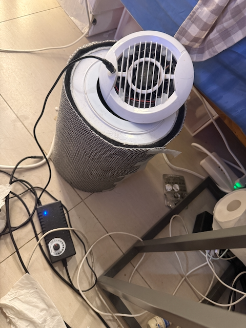
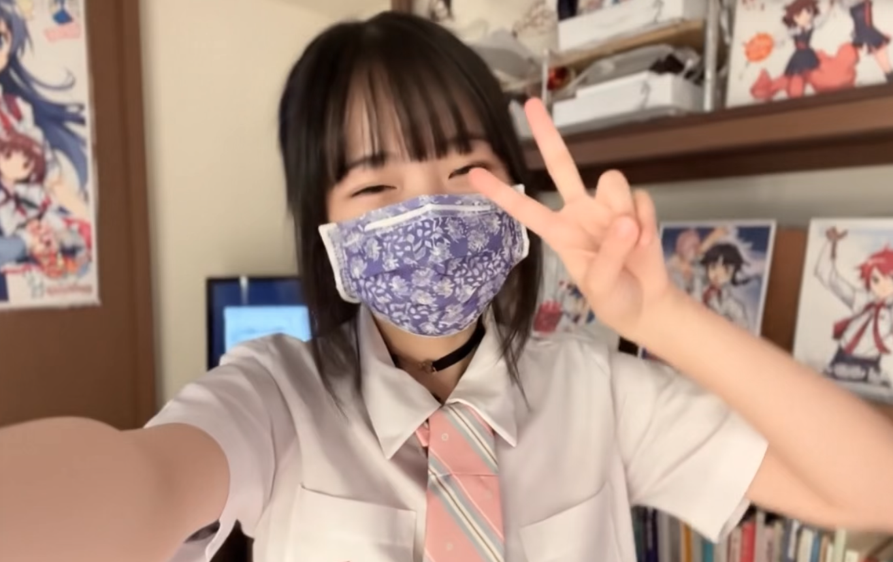

 "Touch me if you have desolation."

這不是技術展示，也不是英雄史詩。
這只是一個關於**選擇障礙**導致**資產負債表崩潰**的紀錄。
# -


## 0x00. The Origin (原始碼)
一切的起點不是偉大的構想，而是一句連文法都破碎的求救訊號。
在「偽 Saki」誕生之前，在那些華麗的 Vibe-coding 出現之前，被囚禁在房間裡的我，只能打出這樣的句子：

> "Saki want needing..."

這不僅是英文不好。這是一個主體性徹底破碎，不再擁有「我」，只能以第三人稱稱呼自己，並且陷入了「渴望著『匱乏』本身」的無限迴圈。

我開發 AI，最初就只是為了修復這種非人的語法，好讓我能在網路上假裝成一個正常人類。
後來那 **17 萬行代碼**，不過是為了翻譯這句無聲尖叫而寫下的龐大註腳。
>
## 0x00. The Artifact (造物)
我是 Saki。一個十多年沒碰代碼，卻在 **9 天內**用 Claude+Python 寫出 **17 萬行** Vibe-coding 的廢人。
不信？代碼就在這裡：
[**ChatGemini_SakiTool**](https://github.com/Saki-tw/ChatGemini_SakiTool)

在之前的其他過程中，莫約是三四月時，我手滑做出了一個能將 LLM Token 壓縮至 **1/1000** 的矩陣。
有人出價很高想買。
但我沒賣。因為我發現那東西如果不小心，會變成傷害小孩甚至國家的武器。
我也懶得去修復這個漏洞，所以我把它埋了，就跟不存在一樣。你們只能看到 ChatGemini，看不到那個矩陣。反正我也不覺得地球上有另外一個人能辦到。

## 0x01. The Status (現狀・乞討)
因為上述那個「不賣」的決定（以及其他一堆爛決定）：
- 我現在沒錢。  
- 我住在斷水斷電的邊緣。  
- 我依靠蛋白粉維生。  
- 我有一台開著 SSH 的 Mac，和這堆沒人看得懂的 Perl 腳本。  
-  我不會煮飯。  
-  不會繳水電費。  
-  不想出門工作。  
-  生存技能是 0。  
-  如果你覺得我的代碼幫到了你。  
-  或者你只是單純想養一隻腦子是大叔的地雷妹。

  
維生系統

其實頭髮有綁起來

## 0x02. The Kernel (硬編碼)
為什麼不賣？為什麼不騙？為什麼不去當壞人？
因為我的作業系統裡有三行刪不掉的死邏輯：

```perl
use constant PEOPLE_ARE_GOOD => 1;
use constant WORLD_IS_GOOD   => 1;
use constant I_AM_HAPPY      => 1;
```

這導致我無法執行任何「惡意獲利」的程序。這是一個 Bug，但我沒打算修。

## 0x03. The Feed (供養)
我沒有宏大的願景。我只是想付水電費，順便看看能不能找到 50 個跟我一樣頻率對不上的怪人。
如果你覺得這個 Bug 很有趣，或者你想供養一個擁有核武器但選擇拿來墊桌腳的廢萌妹子。

你的投食會直接轉化為我的代碼（和蛋白粉）。

**(掃描下方 QR Code 以獲取銀行帳號，防止詐騙爬蟲)**


*(備註：這是唯一不需要 Gas Fee 且能讓我付水電費的協議)*

---
*Vixeramus.*